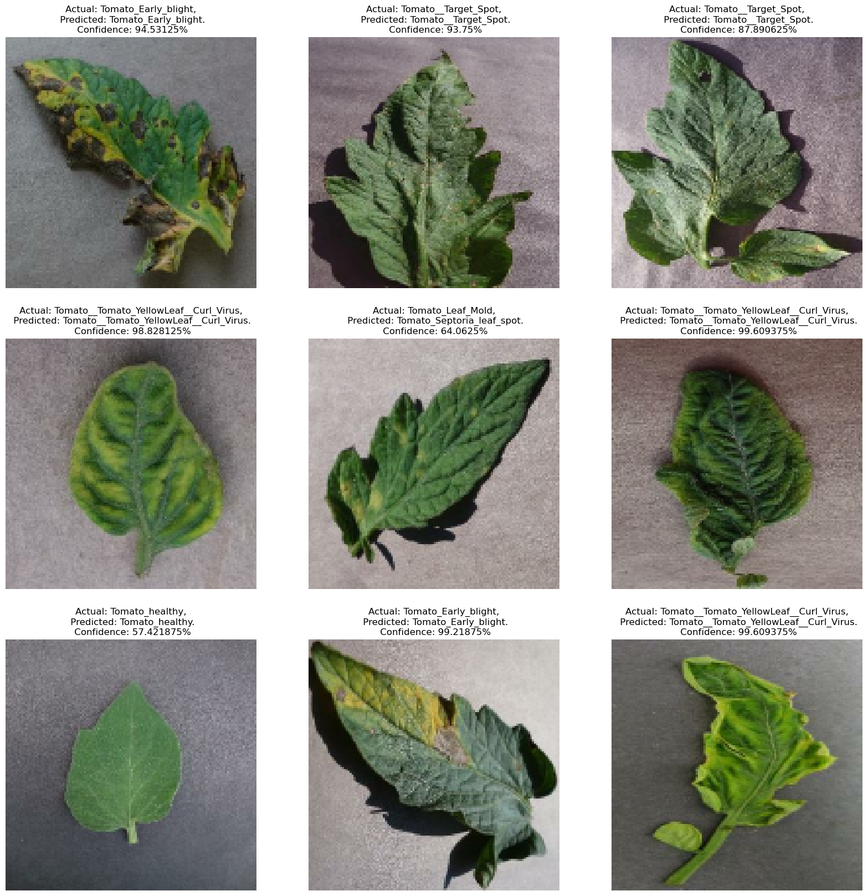

# Tomato Plant Disease Detection using TinyML

## Description
This project develops a lightweight machine learning model using TinyML techniques to detect tomato plant diseases from leaf images in real-time. By leveraging TensorFlow Lite and Edge Impulse, the model runs directly on edge devices, providing immediate insights for agricultural decision-making. With a dataset of 16,011 images across 10 disease categories, the model undergoes rigorous preprocessing, augmentation, and optimization. Real-world testing validates its effectiveness, offering farmers a convenient tool for on-site disease diagnosis, potentially revolutionizing agricultural practices.

## Shortcomings
- `Limited Dataset`: Despite efforts in augmentation, the dataset may still lack comprehensive representation of environmental factors affecting disease manifestation.
- `Dependency on Image Quality`: The model's performance could be hindered by variations in image quality, such as lighting conditions and camera resolution, impacting its real-world applicability.
- `Dependency of Connectivity`: Connectivity limitations in rural areas hinder timely updates and maintenance, compromising the effectiveness of edge-based disease detection models.

## Possible Future Extension
- `Multi-Crop Expansion`: Adapting the model for diverse crops enhances its utility, catering to varied agricultural requirements.
- `Mobile App Integration`: Creating a user-friendly mobile app enables convenient on-the-go disease diagnosis and intervention for farmers.
- `Sensor Data Integration`: Incorporating environmental sensor data enhances disease detection accuracy by considering factors affecting plant health.

### Dataset Used - [Plant Disease](https://www.kaggle.com/datasets/emmarex/plantdisease)

## Key Features
- `Dataset`: Plant Village dataset containing `16,011` tomato leaf images across `10` disease categories.
- `Methodology`: Data preprocessing, model development, conversion, deployment, evaluation, and validation.
- `Results`: Achieved accuracy of `89.6%` in disease identification.
- `Expected Outcomes`: High-performing, lightweight ML model, successful deployment on edge devices, real-world effectiveness.
- `Real-World Use`: Real-time plant health prediction via the Edge Impulse app on mobile devices.

## Input Images

## Model

## Output

## Technology Stack
- TensorFlow
- TensorFlow Lite
- Edge Impulse
- Python

## How to Use
- Clone the repository `git clone https://github.com/its-kumar-yash/Tomato-Plant-Disease-Detection-Model.git`
- Download the dataset.
- Install required dependencies.
- Run the `jupiter notebook`.
- Upload `tf_lite_quantized_model.tflite` file on `Edge Impulse` and Build the model.
